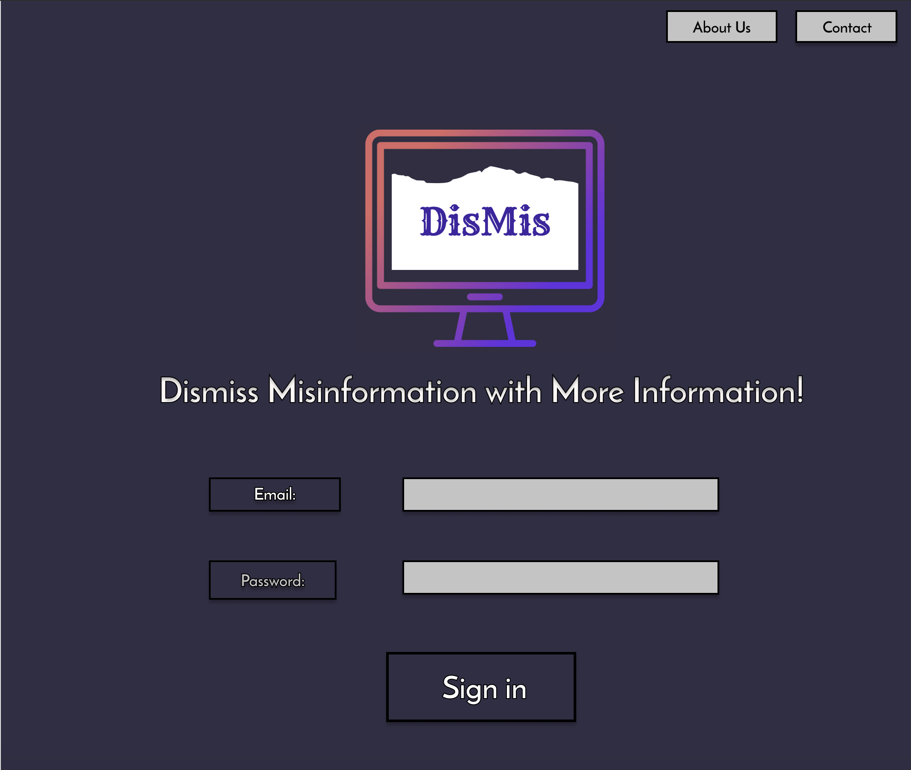
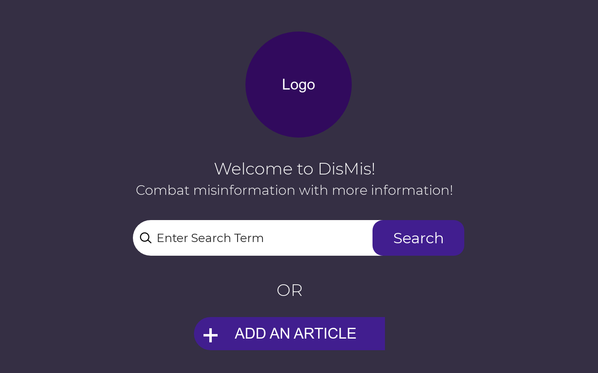
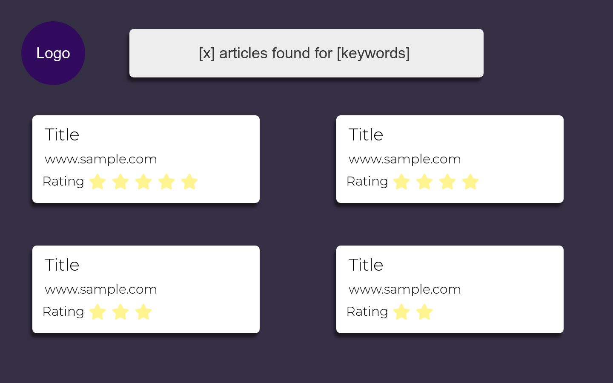
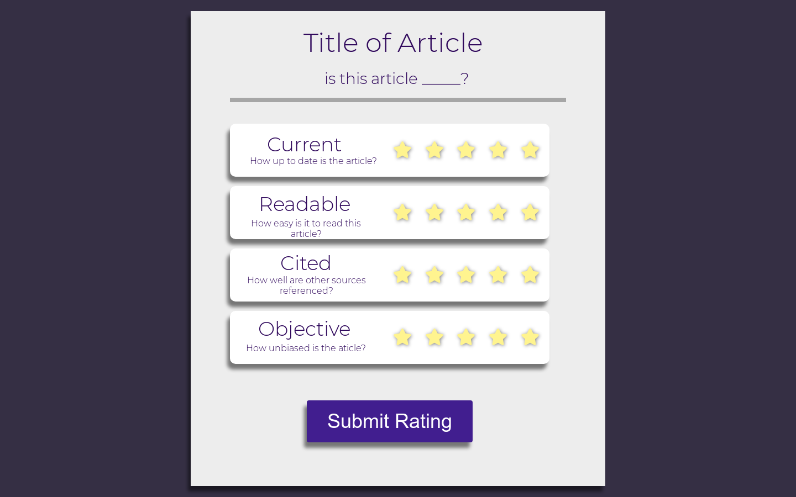
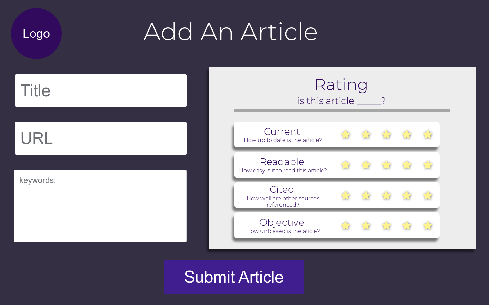
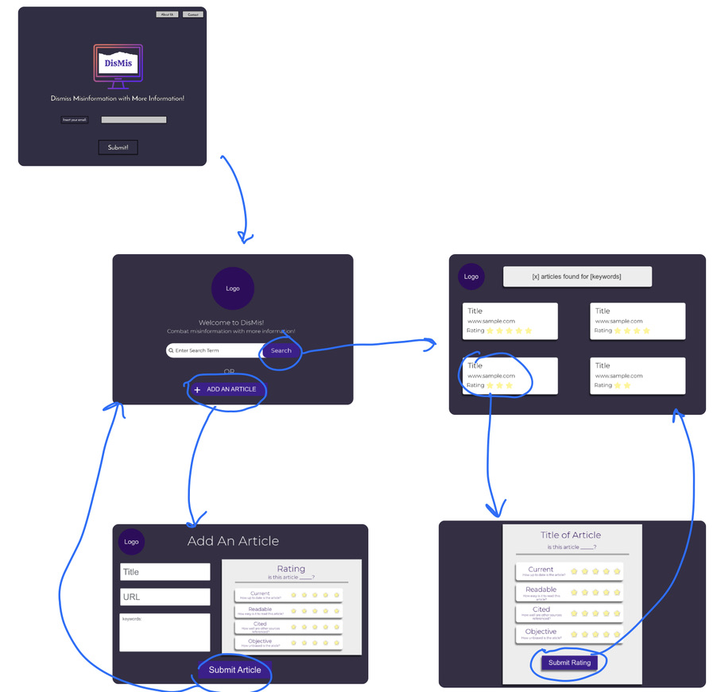

# DisMis 
## Problem Statement 
In order to combat the perpetuating cycle of individuals becoming misinformed due to the rapid spread of fake news, people need a tool that provides users with information to critically analyze the news they consume through crowd-sourced and objectively rated sources. 

## Summary 
Misinformation is false information and can consist of anything from rumors to propaganda to unintentional errors. Emily Thorson, a political scientist at Syracuse University, stated, “People have always been susceptible to misinformation. The real challenge now lies in the immediacy, scope, and ease of dissemination we now see with new technologies like social media.”  

While it is human nature to search for facts that align with preexisting beliefs, evolving media technology allows for rapid dissemination of information with no fact checking process. In a field as biased by personal belief systems and partisanship as politics, the spread of political misinformation causing misperceptions in readers is quite common and in certain contexts, quite dangerous. For example, if misinformation in policies and issues such as voter ID laws causes an individual to stay home from the polls, it is a serious issue.  

Given the current state of American presidential elections defined by “fake news” and “Russian misinformation campaigns”, it is important now more than ever to reduce misinformation within the scope of politics. While there is no monolithic solution to immediately distinguish fact from fiction, this tool aims to implement an objective process as an intervention in the political communication system. Because misinformation is such a complex, human-centric issue, a simple algorithm or AI-based fact checker may only increase the dissemination of misinformation. Thus, this tool’s premise relies on guiding critical thinking of users when rating articles they are receiving political information from and curating a crowdsourced and objectively rated feed of information for the topic the user intends to search.  

The guided rating of articles is based on a series of quantitative measures such as currency, objectivity, readability, citations, and partisanship.  
- Currency: Is this information up to date?  
- Objectivity: Is this information unbiased?  
- Readability: Is this information easy to understand?  
- Citations: Are other sources referenced? Is every statistic accounted for?  

When adding an article to the database and after reading an article from the database, the user will be prompted to rate the article on each of those aforementioned factors on a five-star scale. Those ratings will be averaged to form a cumulative rating for each article. Because the user will see a list of articles in order of highest to lowest rating, the hope is that the user will be exposed to accurate information quickly upon one keyword search. The user will also be able to add articles into the database hence why the application is crowdsourced. While there are many benefits of a crowdsourced feed of information, there are also significant concerns that we hope to alleviate within the scope of our project:  

##### How can we measure the app is successful?  
Once the article is opened in an external tab it is no longer in the interface’s domain, however we can track user interaction by counting the number of clicks within the tool’s interface. Thus we can accumulate abandonment metrics based on when a user stops on a certain path, whether the path be accessing an article, rating an article, or adding an article. A simpler route is to track the # of articles’ URLs being accessed versus the # of ratings. A key value proposition of the tool is that the articles are being rated. Further backend development to track abandonment rate is a future opportunity. 

##### How can we account for trolls/bots/false ratings?  
To account for the issue of false ratings and attempting to ensure that users are only rating articles they have read, the user will only be able to rate articles they are manually entering the links for and for specific articles after clicking on the URL present in the database. The feasibility of this is elaborated on in the Data Structures section. As far as a spam article being entered over and over with high ratings, one precaution is that a user can only enter and rate the same article URL once. This will be monitored by associating rating and article data with a userID and email verification of the user.  
 
## Customer Profile 
DisMis’s initial target market is young social media users. 
Who - people who are consumers of news  
What – they might be consuming inaccurate information. 
Where - on social media, through hearsay 
Why – There's been a growing concern in the past couple of years about the spread of misinformation on social media platforms (“fake news”).  
When – as needed 
How - by rating articles provided to them for a crowdsourced, source vetting product 

#### S1: User seeks out information on a specific political topic 
Tytrayte is a sophomore in high school. For his US Government course, he needs to write a paper about a current event. He remembers seeing the topic of Goya trending a few days ago but only seeing a bunch of memes and jokes about the situation. Considering he needs a more academic understanding of the situation, he goes to our app. He searches the keyword “Goya” in our app and reads the top-rated article. He likes the information, rates it using the rating function, and begins writing his paper. 

#### S2: User enters information on a political topic 
Mari just heard about a political rally in her small town and she wanted to find out about the details to know what areas to avoid. She knows there has been a lot of hearsay and gossip about the matter, so she uses her new search tool, DisMis, to see if anyone has already accounted for accurate articles on the subject. After searching “Town Rally”, she sees that no one has entered information on the topic, so she decides to do some research of her own. After finding a well cited article by a local reporting service, Mari decides to upload the source to DisMis and rate it 5 stars so that the next person that searches for it will be directed to a great source. 

#### S3: User seeks out information on popular political topics  
 Jenny is a full-time college student who tries not to get political information from social media because she knows there is a lot of fake news. However, she still wants to be #woke about relevant, popular topics that people are talking about. Using her trusted information sourcing tool, DisMis, she can see topics that people have been researching within that week. She also wants to be able to talk about the situation with a degree of understanding of perspectives from different sources. She uses our app to quickly pool together different articles and gain confidence in her knowledge and ability to share the information. 

## Goals 
#### Combating misinformation 
People, especially the younger generation, want to be informed, but they lack the tools necessary to critically analyze what they consume so providing the tool that people need in order to inform themselves is one way of combating misinformation. 

#### Creating a generation of critical thinkers 
Online and social media serve as the main source of news for the majority of individuals between the ages of 18 and 34. Not surprisingly, Millennials and Generation Z are the least likely generations to turn TV, radio, or print for news and it’s becoming increasingly important for Millennials and Generation Z to apply critical thinking to the news and information they consume on daily basis.1 

Due to the advancements in communication as a side effect of the Information Age, the accessibility of information to most individuals is no longer as significant of an issue as is the consumption of accurate information. While it is difficult to regulate the validity of claims and statistics that come from various sources as the information is spread so rapidly and in mass, it is a simpler task to provide the consumer with information about the source of information so they can analyze whether that source is more likely to be valid before generating biases by blindly consuming and sharing information from the first source they come across. The user can make up their own mind without any information censoring or propaganda present in the algorithm of the tool. The information is rated for the users by the users.  

## In Scope  

P0: The user can enter an email and sign up to access DisMis with a userID.  
P0: The user can access a home page with a DisMis logo, brief description of service, and a search bar component. 
P0: The user can search a keyword.  
P0: The user can add a new article with new keywords and will be prompted to do so if the keyword searched is not available in the database.  
P0: The user can browse a list of sources related to the keyword sorted from the highest rating to the lowest rating. 
P0: The user can see the cumulative article rating, # of ratings, headline for each source, and click on the article’s URL.  
P0: The user can read the article on a separate tab.  
P0: The user can rate the article on objectivity, currency, readability, citations, and partisanship.  
P1: The user can access the app with a designated username.  
P1: The user can see a list of sources related to popular/trending keywords. 
P2: The user can re-rate an article they previously rated.  
P2: Certain articles with drastic differences in ratings can be flagged. 

## Out of Scope  
P3: The user can create a DisMis account  
P3: The user can access personal article viewing and rating history.  
P3: Users can send sources to each other via DisMis.  
P3: The user can see the rating for every source criterion.  
P3: The users will be able to provide article commentary on DisMis.  

## S1- S2: UX – A Desktop Experience 
When first logging into the app, they are prompted to sign in with an email. This will be fleshed out into a larger system later

After a user logs into DisMis, they see a simple home screen with a search bar and a button to add an article.  

If a source is found then the user is presented with this screen that has a list of articles. From here they can read articles that are sorted based on their rating provided by the community.  

Here is the tab where the user can provide feedback on the article they just read. They rate it on 4 different criteria. This feedback is then used to build on a user database that stores aggregated ratings for displaying articles based on rankings  

Here the user can add an article to the database and give it an initial rating. They can only add and rate any specific article once.  

S3: Logic Behind the ‘Popular Topics’ 
- Within the search view, there’s the Popular Topics that users can explore when they don’t want to look for topics (the ones that would typically call for some keywords insertion). The Popular Topics lists 3 buttons, each taking you to a different list of news articles when clicked. These buttons change topics weekly, according to what topics have the highest number of articles. (P1) 

#### Navigation 

The current flow includes a new tab being opened then being able to go back into the flow of the app to rate it 

Description automatically generated 

The data will be handled via Redux. 
Data will be stored as a json with an array of articles 
##### User Object: 
- User Email: string containin the user's name `<String>`
- UserId: the id of the user `<Number>`

###### Article objects will have these properties: 
- Title: User entered Title of the Article `<String>`
- URL: The link to the article’s content passed from the user `<String>` 
- Rating: an object with the rating of the article’s different properties `<Rating>` 
- Keywords: a list of words that are related to the article `List<string>`
- Date Added: The time the article was added to the database `<Date>` 

##### A rating object will have these numerical <Number> properties: 

Total ratings will be stored for each category along with the total number of ratings. 
- Current, Readable, Cited, Objective and number of ratings 

##### API Surface 

`List<Articles> GetArticles(string Interest)` >> to support search results 

: List of articles will be returned with their overall ratings rounded to the nearest 0.5. 

`void RateArticle(Rating parameters, userId)` >> to support rating articles and adding articles  

: Will take in the individual rating and add them to the total aggregate rating and add the userId to the list of users who have rated the article   

`void AddArticles(Article params, Rating params, userId)` >> to support adding an article 

: Will add an article to the database along with the userId of the user who added and the initial ratings that the user provided. 

The average is calculated by aggregating the numeric 1-5 value for each criteria into a net rating value (eg: 1 rating = 4 for currency, 3 for objectivity, 3 for readability, and 5 for citations = 15. This number is added to the previous net rating value from previous users. This value will be divided by the number of ratings times the number of criteria. So, for the scope of this app, there are 4 criterion(eg: (15 + initial net rating value)/(4*total ratings).

## Breakdown of Work 
|User Story| Team Member|
|--|--|
|P0: The user can enter an email and password to sign in, which would render them a unique user ID. | Rabeca |
|P0: The user can access a home page with an DisMis logo, brief description of service, and a search bar component.  |Hiwot|
|P0: The user can add a new article with new keywords.|Megha|
|P0: The user can browse a list of sources related to the keyword sorted from the highest rating to the lowest rating. |Alex|
|P0: The user can rate the article on objectivity, currency, readability, and citations.|Josh| 
|P1: The user can see a list of articles related to popular/trending keywords. |Alex|
|P2: The user can see suggested keywords if the entry does not match the exact keywords in the database. |Rabeca|

## Competitor Analysis 
#### The competitors of DisMis today include: 
- Google.com: Having a robust system like the Search index, Google contains more info than in all the world’s libraries put together, thus rendering thousands, sometimes millions, of news articles. 
- PublicEditor.io: Public Editor consists of users who vet news articles. 

#### From the summary of the competitive analysis, the primary strength, weaknesses, opportunities, and threats of DisMis in comparison to Google are: 

Strengths: 
- The rating of sources is visible in the list view 
- User receives indication of validity and bias before reading a source 
- Google has been known for censorship of results and content and the premise of this tool is to avoid the censorship of ideas. 

Weaknesses: 
- The amount of content that DisMis has depends on our userbase 
- DisMis has less sophisticated keyword search system 
- Users from Google are very loyal to Google because of its efficient search query system and our tool’s query system is a little more tedious.  

Opportunities: 
- It is hard for Google to manage personal user experience because they have a large amount of data, DisMis can cater for more intimate and communal experience. 
- Limits perpetuation of the cycling of misinformation by allowing users to be critical of how they consume news. 

Threats: 
- Generating an active userbase that continually contributes to the database 
- Users with bad intentions may disrupt the rating inaccurately purposefully 
- Generating a big enough corpus of rated documents seems like a challenge given that news articles have a very short shelf life 

 

## Future Opportunities 
- Determine which users are spamming or trolling the ratings for an article. 
- The ratings for articles on our site are determined based on the website’s users. This functionality has the risk of being compromised by trolls. 
- Future opportunities encompass further backend development to detect significant differences between ratings and perhaps flagging articles to alert users of fluxes and a chance of trolling.  
- Having the app be available in multiple languages and countries. 
- Upon release our app will only be available in the United States and in English 
- Eventually we could expand to many different regions and host dozens of languages.  

 
